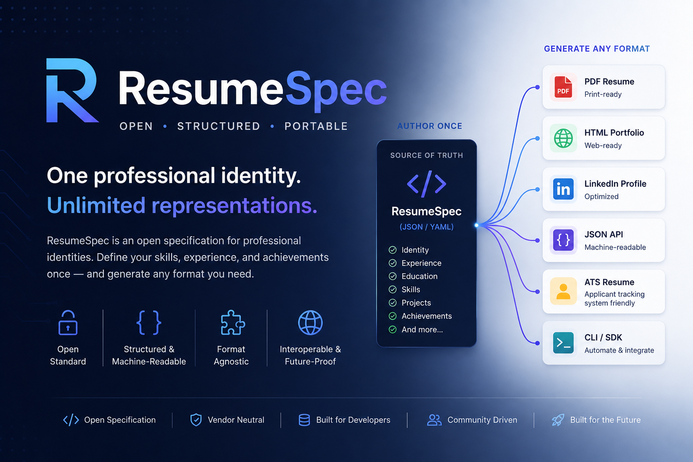

# ResumeSpec

<p align="center">
  
</p>

<p align="center">

**One professional identity. Unlimited representations.**

</p>

<p align="center">

[](LICENSE)


</p>

---

## Overview

ResumeSpec is an **open specification** for representing professional identities in a structured, portable, and machine-readable format.

Instead of treating a résumé as the source of truth, ResumeSpec defines a **canonical professional profile** capable of generating multiple representations while preserving the same underlying information.

A résumé becomes **one possible output**, not the original source.

---

## Why ResumeSpec?

Today, professionals manually maintain the same information across multiple platforms:

- Résumés
- LinkedIn profiles
- Personal websites
- ATS platforms
- HR systems
- Freelance marketplaces
- Developer portfolios

Every update requires rewriting, reformatting, and synchronizing identical information.

This duplication creates:

- inconsistent data
- outdated profiles
- unnecessary manual work
- vendor lock-in
- poor interoperability

ResumeSpec proposes a different approach.

Maintain **one structured professional identity**, then generate every required representation from that single source.

---

# The Idea

```
                    ResumeSpec
              (Single Source of Truth)

                    JSON / YAML
                         │
        ┌────────────────┼─────────────────┐
        │                │                 │
        ▼                ▼                 ▼

    PDF Resume      ATS Resume      Portfolio Website

        ▼                ▼                 ▼

 LinkedIn Profile   JSON API      AI Context / LLM

```

Author once.

Publish everywhere.

---

# Example

A ResumeSpec profile might look like:

```yaml
person:
  name: Jane Doe
  title: Security Analyst

experience:
  company: ACME
  role: SOC Analyst

skills:
  - Python
  - Linux
  - SIEM
```

From that single document, ResumeSpec could generate:

- PDF résumé
- ATS résumé
- LinkedIn profile
- Portfolio website
- HTML profile
- Markdown profile
- JSON API
- AI-ready context
- Future formats not yet invented

---

# Core Principles

ResumeSpec is built around a few fundamental ideas.

- One person has one professional identity.
- Documents are representations, not the source.
- Information should be structured instead of formatted.
- Human-readable.
- Machine-readable.
- Vendor-neutral.
- Extensible.
- Open.
- Future-proof.

---

# What ResumeSpec Is

ResumeSpec is:

- an open specification
- a portable professional profile
- a structured data model
- a canonical representation of professional identity
- a foundation for tools and generators
- an interoperability layer between professional platforms

---

# What ResumeSpec Is Not

ResumeSpec is **not**:

- a résumé template
- a PDF generator
- a design system
- a recruiting platform
- a LinkedIn replacement
- a portfolio builder

Those are outputs.

ResumeSpec defines the source.

---

# Why Now?

Artificial Intelligence is changing how professional information is created, consumed, and exchanged.

Recruiters, ATS platforms, portfolio generators, LLMs, developer tools, and career platforms all require structured professional data.

ResumeSpec aims to become the common language between those systems.

Think of it as:

> **Professional Identity Layer for Humans and AI.**

---

# Repository Structure

```
ResumeSpec/

├── assets/
│   ├── banners/
│   ├── icons/
│   └── logos/
│
├── docs/
├── examples/
├── rfcs/
├── schemas/
├── spec/
│
├── tests/
│
├── CHANGELOG.md
├── CODE_OF_CONDUCT.md
├── CONTRIBUTING.md
├── LICENSE
├── PROJECT_STATUS.md
├── ROADMAP.md
├── VISION.md
└── README.md
```

---

# Documentation

| Document | Description |
|-----------|-------------|
| `VISION.md` | Long-term vision |
| `ROADMAP.md` | Planned milestones |
| `PROJECT_STATUS.md` | Current development status |
| `CHANGELOG.md` | Project history |
| `spec/` | Specification documents |
| `schemas/` | Official schemas |
| `rfcs/` | Proposed specification changes |

---

# Project Roadmap

## Phase 1 — Foundation

- ✅ Repository architecture
- ✅ Vision
- ✅ Documentation
- ✅ Versioning strategy
- ✅ Initial specification
- ✅ Testing framework

---

## Phase 2 — Specification

- JSON Schema
- YAML Schema
- Section definitions
- Validation rules
- Reference examples

---

## Phase 3 — Tooling

- Reference parser
- CLI
- Validator
- SDK
- Documentation website

---

## Phase 4 — Ecosystem

- Resume generators
- Portfolio generators
- ATS exporters
- AI integrations
- Community extensions

---

# Current Status

**Version:** 0.1.0

Status:

**Alpha**

ResumeSpec is currently under active design.

The specification is evolving through community discussion and RFCs before reaching its first stable release.

Early feedback is encouraged.

---

# Contributing

Contributions are welcome.

Whether you're a:

- Developer
- Recruiter
- HR Professional
- Designer
- Hiring Manager
- Researcher

your feedback is valuable.

Before contributing, please read:

- CONTRIBUTING.md
- CODE_OF_CONDUCT.md

---

# Vision

People do not have multiple careers.

They have **one professional identity** expressed through many different formats.

ResumeSpec standardizes that identity.

---

# License

Released under the MIT License.

See the LICENSE file for details.

---

<p align="center">

**Author once. Publish everywhere.**

*Open. Portable. Structured.*

</p>
